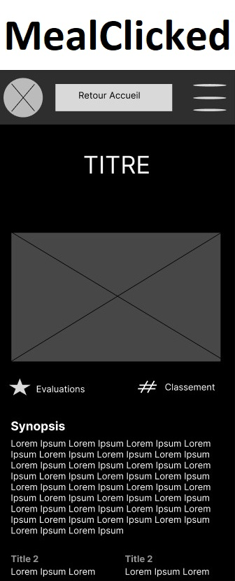

# AppliBouffe

les PUSH nécéssitent juste une PR pour pouvoir merge, pas de confirmation (comme ça on peut push sans attendre les amis -et Nico- pour se débrouiller seul, donc faites gaffe au cas où)  
  
branc INDEX et DEVELOP créées
  
en gros si cela pouvait ressembler à ça  
  
component pour `MainPage` (incluant les app Header, Dropdown et List) et `MealCliked` créé
  
   

## SCSS

Projet créé en `SCSS` sur le principe ça fonctionne à 95% comme CSS, les variables sont différentes (déjà installé) (si besoin la quête [SCSS Odyssey](https://odyssey.wildcodeschool.com/quests/551). Donc vous pouvez coder en CSS sur les fichiers SCSS.  
J'ai déjà posé quelques variables (couleurs et polices) qu'on adaptera plus tard quand l'esthétique deviendra intéréssant, pour le moment c'ets pas le problème, mais essayez-de vous servir des variables, pour pas qu'on se retartine tout à la fin.
